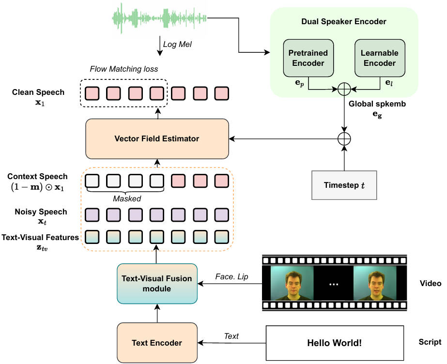

## SyncVoice: Towards Video Dubbing with Vision-Augmented Pretrained TTS Model

[Result in GRID Dub 2.0 Setting](#Setting1V2C) \
[Result in EN-EN Test-set](#Setting2V2C) \
[Result of EN-ZH Test-set](#zeroshot)

## Abstract
Video dubbing aims to generate high-fidelity speech that is precisely temporally aligned with the visual content. Existing methods still suffer from limitations in speech naturalness and audio-visual synchronization, and most do not account for multilingual applications. To address these issues, we build upon the pretrained text-to-speech (TTS) model and fine-tune it on an audio-visual dataset to achieve audio-visual consistency. Furthermore, we propose a Dual Speaker Encoder to effectively mitigate inter-language interference in cross-lingual speech synthesis. We also explore the application of video dubbing in video translation scenarios. Experimental results show that our method outperforms existing state-of-the-art video dubbing models in both speech quality and synchronization performance, and demonstrates potential for video translation tasks.

### GRID sample on Dub 2.0
### Sample #1
#### Script: Bin blue at l two please.
Reference Audio：

<audio controls src="Grid/sample1/s7-lwwszp_for_bbal2p.wav" title="Title"></audio>
<table border="1">
    <tr>
        <td>

<video  width="330" height="170" controls>
  <source src="Grid/sample1/EmoDubber@s7_bbal2p.mp4" type="video/mp4">
  Your browser does not support the video tag.
</video>
<figcaption>EmoDubber</figcaption>
        </td>
        <td>
<video  width="330" height="170" controls>
  <source src="Grid/sample1/ProDubber@s7_bbal2p.mp4" type="video/mp4">
  Your browser does not support the video tag.
</video>
<figcaption>ProDubber</figcaption>
        </td>
        </tr>
        <tr>
        <td>
<video  width="330" height="170" controls>
  <source src="Grid/sample1/Ours@s7_bbal2p.mp4" type="video/mp4">
  Your browser does not support the video tag.
</video>
<figcaption>Ours</figcaption>
        </td>
        <td>
<video  width="330" height="170" controls>
  <source src="Grid/sample1/gt@s7_bbal2p.mp4" type="video/mp4">
  Your browser does not support the video tag.
</video>
<figcaption>GT</figcaption>
        </td>
    </tr>
</table>

### Sample #2
#### Script: Place red at v eight sp please.
Reference Audio：

<audio controls src="Grid/sample2/s3-pwax5a_for_prav8p.wav" title="Title"></audio>
<table border="1">
    <tr>
        <td>

<video  width="330" height="170" controls>
  <source src="Grid/sample2/EmoDubber@s3_prav8p.mp4" type="video/mp4">
  Your browser does not support the video tag.
</video>
<figcaption>EmoDubber</figcaption>
        </td>
        <td>
<video  width="330" height="170" controls>
  <source src="Grid/sample2/ProDubber@s3_prav8p.mp4" type="video/mp4">
  Your browser does not support the video tag.
</video>
<figcaption>ProDubber</figcaption>
        </td>
        </tr>
        <tr>
        <td>
<video  width="330" height="170" controls>
  <source src="Grid/sample2/Ours@s3_prav8p.mp4" type="video/mp4">
  Your browser does not support the video tag.
</video>
<figcaption>Ours</figcaption>
        </td>
        <td>
<video  width="330" height="170" controls>
  <source src="Grid/sample2/gt@s3_prav8p.mp4" type="video/mp4">
  Your browser does not support the video tag.
</video>
<figcaption>GT</figcaption>
        </td>
    </tr>
</table>

### Sample #3
#### Script: Set white in e nine now.
Reference Audio：

<audio controls src="Grid/sample3/s28-pgwpza_for_swie9n.wav" title="Title"></audio>
<table border="1">
    <tr>
        <td>

<video  width="330" height="170" controls>
  <source src="Grid/sample3/EmoDubber@s28_swie9n.mp4" type="video/mp4">
  Your browser does not support the video tag.
</video>
<figcaption>EmoDubber</figcaption>
        </td>
        <td>
<video  width="330" height="170" controls>
  <source src="Grid/sample3/ProDubber@s28_swie9n.mp4" type="video/mp4">
  Your browser does not support the video tag.
</video>
<figcaption>ProDubber</figcaption>
        </td>
        </tr>
        <tr>
        <td>
<video  width="330" height="170" controls>
  <source src="Grid/sample3/Ours@s28_swie9n.mp4" type="video/mp4">
  Your browser does not support the video tag.
</video>
<figcaption>Ours</figcaption>
        </td>
        <td>
<video  width="330" height="170" controls>
  <source src="Grid/sample3/gt@s28_swie9n.mp4" type="video/mp4">
  Your browser does not support the video tag.
</video>
<figcaption>GT</figcaption>
        </td>
    </tr>
</table>

### EN-EN test-set sample
### Sample #1
#### Script: And while his fellow Republicans squabble over the budget, Governor Walker is off pursuing his presidential ambitions.
Reference Audio：

<audio controls src="en2en/sample1/ref_RD_Radio12_S00005.wav" title="Title"></audio>
<table border="1">
    <tr>
        <td>

<video  width="330" height="170" controls>
  <source src="en2en/sample1/TTS@RD_Radio12_S00005.mp4" type="video/mp4">
  Your browser does not support the video tag.
</video>
<figcaption>Zero-shot TTS</figcaption>
        </td>
        <td>
<video  width="330" height="170" controls>
  <source src="en2en/sample1/M1@RD_Radio12_S00005.mp4" type="video/mp4">
  Your browser does not support the video tag.
</video>
<figcaption>M1</figcaption>
        </td>
        </tr>
        <tr>
        <td>
<video  width="330" height="170" controls>
  <source src="en2en/sample1/M3_Ours@RD_Radio12_S00005.mp4" type="video/mp4">
  Your browser does not support the video tag.
</video>
<figcaption>M3 (Ours)</figcaption>
        </td>
        <td>
<video  width="330" height="170" controls>
  <source src="en2en/sample1/gt@RD_Radio12_S00005.mp4" type="video/mp4">
  Your browser does not support the video tag.
</video>
<figcaption>GT</figcaption>
        </td>
    </tr>
</table>

### Sample #2
#### Script: But Fred Korematsu never stopped fighting for justice and civil rights for all Americans. And we must do the same. We must continue to stand up for all immigrants and fight to keep history from repeating itself.
Reference Audio：

<audio controls src="en2en/sample2/ref_WDA_MazieHirono1_S00023.wav" title="Title"></audio>
<table border="1">
    <tr>
        <td>

<video  width="330" height="170" controls>
  <source src="en2en/sample2/TTS@WDA_MazieHirono1_S00023.mp4" type="video/mp4">
  Your browser does not support the video tag.
</video>
<figcaption>Zero-shot TTS</figcaption>
        </td>
        <td>
<video  width="330" height="170" controls>
  <source src="en2en/sample2/M1@WDA_MazieHirono1_S00023.mp4" type="video/mp4">
  Your browser does not support the video tag.
</video>
<figcaption>M1</figcaption>
        </td>
        </tr>
        <tr>
        <td>
<video  width="330" height="170" controls>
  <source src="en2en/sample2/M3_Ours@WDA_MazieHirono1_S00023.mp4" type="video/mp4">
  Your browser does not support the video tag.
</video>
<figcaption>M3 (Ours)</figcaption>
        </td>
        <td>
<video  width="330" height="170" controls>
  <source src="en2en/sample2/gt@WDA_MazieHirono1_S00023.mp4" type="video/mp4">
  Your browser does not support the video tag.
</video>
<figcaption>GT</figcaption>
        </td>
    </tr>
</table>

### Sample #3
#### Script: Patient lives are impacted. Diagnoses are made. Treatments are administered and healing begins.
Reference Audio：

<audio controls src="en2en/sample3/ref_WRA_JimInhofe_S00008.wav" title="Title"></audio>
<table border="1">
    <tr>
        <td>

<video  width="330" height="170" controls>
  <source src="en2en/sample3/TTS@WRA_JimInhofe_S00008.mp4" type="video/mp4">
  Your browser does not support the video tag.
</video>
<figcaption>Zero-shot TTS</figcaption>
        </td>
        <td>
<video  width="330" height="170" controls>
  <source src="en2en/sample3/M1@WRA_JimInhofe_S00008.mp4" type="video/mp4">
  Your browser does not support the video tag.
</video>
<figcaption>M1</figcaption>
        </td>
        </tr>
        <tr>
        <td>
<video  width="330" height="170" controls>
  <source src="en2en/sample3/M3_Ours@WRA_JimInhofe_S00008.mp4" type="video/mp4">
  Your browser does not support the video tag.
</video>
<figcaption>M3 (Ours)</figcaption>
        </td>
        <td>
<video  width="330" height="170" controls>
  <source src="en2en/sample3/gt@WRA_JimInhofe_S00008.mp4" type="video/mp4">
  Your browser does not support the video tag.
</video>
<figcaption>GT</figcaption>
        </td>
    </tr>
</table>

### EN-ZH test-set sample

### Sample #1
#### Script: 这包括要求对教师和各类学校员工进行背景核查，保障开除学生的权利，强化监管。
#### Reference:
That includes requiring background checks for teachers and other school employees, rights for student expulsion, strengthening oversight
<video width="320" height="140" controls>
  <source src="en2zh/sample1/ref@RD_Radio1_S00005.mp4" type="video/mp4">
  Your browser does not support the video tag.
</video>

<table border="1">
    <tr>
        <td>

<video  width="330" height="170" controls>
  <source src="en2zh/sample1/TTS@RD_Radio1_S00005_1.mp4" type="video/mp4">
  Your browser does not support the video tag.
</video>
<figcaption>Zero-shot TTS</figcaption>
        </td>
        <td>
<video  width="330" height="170" controls>
  <source src="en2zh/sample1/M1@RD_Radio1_S00005_1.mp4" type="video/mp4">
  Your browser does not support the video tag.
</video>
<figcaption>M1</figcaption>
        </td>
        <td>
<video  width="330" height="170" controls>
  <source src="en2zh/sample1/M2@RD_Radio1_S00005_1.mp4" type="video/mp4">
  Your browser does not support the video tag.
</video>
<figcaption>M2</figcaption>
        </td>
        <td>
<video  width="330" height="170" controls>
  <source src="en2zh/sample1/M4@RD_Radio1_S00005_1.mp4" type="video/mp4">
  Your browser does not support the video tag.
</video>
<figcaption>M4</figcaption>
        </td>
    <td>
<video  width="330" height="170" controls>
  <source src="en2zh/sample1/M5_Ours@RD_Radio1_S00005_1.mp4" type="video/mp4">
  Your browser does not support the video tag.
</video>
<figcaption>M5 (Ours)</figcaption>
        </td>
    </tr>
</table>

### Sample #2
#### Script: 在国会，众议院民主党人为民履职，顺应民意，以压倒性多数通过了H.R.六号《美国梦想与承诺法案》，此案早逾一百六十天送抵参院。
#### Reference:
 In Congress, House Democrats have delivered for the people and honored their will by overwhelmingly passing H.R. 6, the American Dream and Promise Act, sent to the Senate over 160 days ago.
<video width="320" height="140" controls>
  <source src="en2zh/sample2/ref@WDA_VeronicaEscobar0_S00008.mp4" type="video/mp4">
  Your browser does not support the video tag.
</video>

<table border="1">
    <tr>
        <td>

<video  width="330" height="170" controls>
  <source src="en2zh/sample2/TTS@WDA_VeronicaEscobar0_S00008_2.mp4" type="video/mp4">
  Your browser does not support the video tag.
</video>
<figcaption>Zero-shot TTS</figcaption>
        </td>
        <td>
<video  width="330" height="170" controls>
  <source src="en2zh/sample2/M1@WDA_VeronicaEscobar0_S00008_2.mp4" type="video/mp4">
  Your browser does not support the video tag.
</video>
<figcaption>M1</figcaption>
        </td>
        <td>
<video  width="330" height="170" controls>
  <source src="en2zh/sample2/M2@WDA_VeronicaEscobar0_S00008_2.mp4" type="video/mp4">
  Your browser does not support the video tag.
</video>
<figcaption>M2</figcaption>
        </td>
        <td>
<video  width="330" height="170" controls>
  <source src="en2zh/sample2/M4@WDA_VeronicaEscobar0_S00008_2.mp4" type="video/mp4">
  Your browser does not support the video tag.
</video>
<figcaption>M4</figcaption>
        </td>
    <td>
<video  width="330" height="170" controls>
  <source src="en2zh/sample2/M5_Ours@WDA_VeronicaEscobar0_S00008_2.mp4" type="video/mp4">
  Your browser does not support the video tag.
</video>
<figcaption>M5 (Ours)</figcaption>
        </td>
    </tr>
</table>

### Sample #3
#### Script: 扭转嗜瘾趋势，需用全面而周详的策略，且务必涵盖治疗、预防、教育、以及对康复个体的支持，并加大遏制力度。
#### Reference:
Reversing the tide of addiction will take a comprehensive, thoughtful approach and must include strategies for treatment, prevention, education, support for individuals in recovery, and increased interdiction.
<video width="320" height="140" controls>
  <source src="en2zh/sample3/ref@WRA_KellyAyotte_S00014.mp4" type="video/mp4">
  Your browser does not support the video tag.
</video>

<table border="1">
    <tr>
        <td>

<video  width="330" height="170" controls>
  <source src="en2zh/sample3/TTS@WRA_KellyAyotte_S00014_2.mp4" type="video/mp4">
  Your browser does not support the video tag.
</video>
<figcaption>Zero-shot TTS</figcaption>
        </td>
        <td>
<video  width="330" height="170" controls>
  <source src="en2zh/sample3/M1@WRA_KellyAyotte_S00014_2.mp4" type="video/mp4">
  Your browser does not support the video tag.
</video>
<figcaption>M1</figcaption>
        </td>
        <td>
<video  width="330" height="170" controls>
  <source src="en2zh/sample3/M2@WRA_KellyAyotte_S00014_2.mp4" type="video/mp4">
  Your browser does not support the video tag.
</video>
<figcaption>M2</figcaption>
        </td>
        <td>
<video  width="330" height="170" controls>
  <source src="en2zh/sample3/M4@WRA_KellyAyotte_S00014_2.mp4" type="video/mp4">
  Your browser does not support the video tag.
</video>
<figcaption>M4</figcaption>
        </td>
    <td>
<video  width="330" height="170" controls>
  <source src="en2zh/sample3/M5_Ours@WRA_KellyAyotte_S00014_2.mp4" type="video/mp4">
  Your browser does not support the video tag.
</video>
<figcaption>M5 (Ours)</figcaption>
        </td>
    </tr>
</table>

