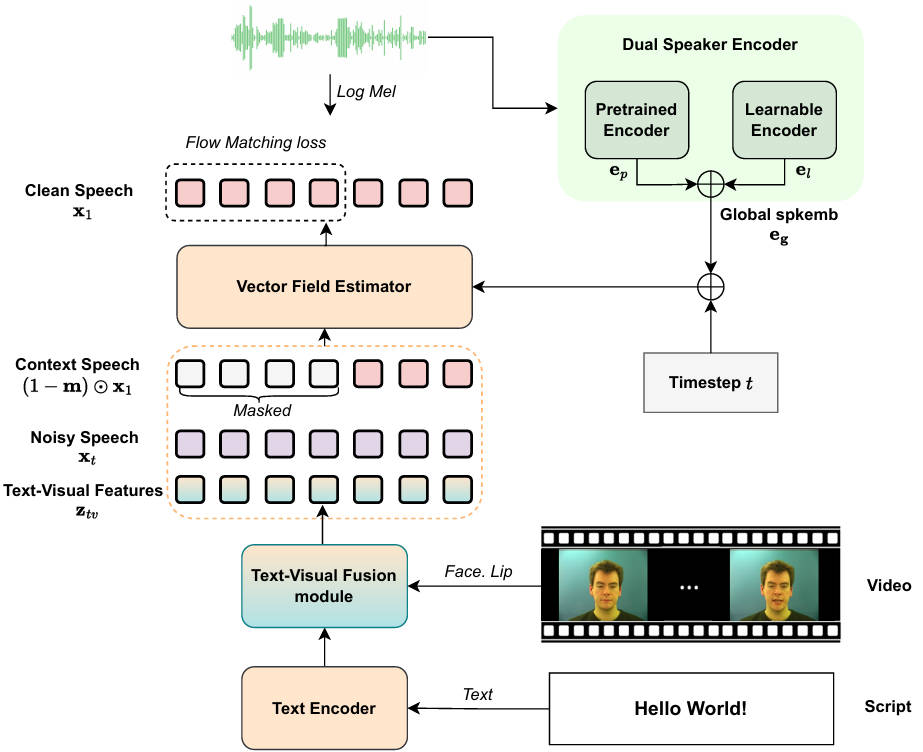

## SyncVoice: Towards Video Dubbing with Vision-Augmented Pretrained TTS Model

<!-- **Training on GRID Dataset**
- [GRID Dub 2.0 Setting](#Setting1V2C) -->

**Training on LRS3 Dataset**
- [EN-EN Test-set](#Setting2V2C)

**Training on Internal Bilingual Dataset**
- [EN-EN Test-set](#Setting3V2C)
- [ZH-ZH Test-set](#Setting4V2C)

<!--  -->

## Abstract
Video dubbing aims to generate high-fidelity speech that is temporally aligned with visual content. However, existing methods still suffer from limited speech naturalness and insufficient audio-visual synchronization, and are often confined to monolingual settings. To address these challenges, we propose SyncVoice, a vision-augmented framework that integrates a Text-Visual Fusion Module into a pretrained text-to-speech (TTS) system. This module aligns multi-modal visual features with linguistic representations, enabling temporally synchronized speech synthesis. Experiments on the publicly available LRS3 dataset show that SyncVoice achieves state-of-the-art performance in zero-shot dubbing, surpassing prior methods in both speech quality and synchronization accuracy. Scaling training to a large-scale Chinese-English bilingual audio-visual dataset further enhances vocal fidelity while preserving synchronization, enabling a unified model for both Chinese and English dubbing.
<!-- 

### GRID sample on Dub 2.0
### Sample #1
#### Script: Bin blue at l two please.
Reference Audio：

<audio controls src="Grid/sample1/s7-lwwszp_for_bbal2p.wav" title="Title"></audio>
<table border="1">
    <tr>
        <td>

<video  width="330" height="170" controls>
  <source src="Grid/sample1/EmoDubber@s7_bbal2p.mp4" type="video/mp4">
  Your browser does not support the video tag.
</video>
<figcaption>EmoDubber</figcaption>
        </td>
        <td>
<video  width="330" height="170" controls>
  <source src="Grid/sample1/ProDubber@s7_bbal2p.mp4" type="video/mp4">
  Your browser does not support the video tag.
</video>
<figcaption>ProDubber</figcaption>
        </td>
        </tr>
        <tr>
        <td>
<video  width="330" height="170" controls>
  <source src="Grid/sample1/Ours@s7_bbal2p.mp4" type="video/mp4">
  Your browser does not support the video tag.
</video>
<figcaption>Ours</figcaption>
        </td>
        <td>
<video  width="330" height="170" controls>
  <source src="Grid/sample1/gt@s7_bbal2p.mp4" type="video/mp4">
  Your browser does not support the video tag.
</video>
<figcaption>GT</figcaption>
        </td>
    </tr>
</table>

### Sample #2
#### Script: Place red at v eight sp please.
Reference Audio：

<audio controls src="Grid/sample2/s3-pwax5a_for_prav8p.wav" title="Title"></audio>
<table border="1">
    <tr>
        <td>

<video  width="330" height="170" controls>
  <source src="Grid/sample2/EmoDubber@s3_prav8p.mp4" type="video/mp4">
  Your browser does not support the video tag.
</video>
<figcaption>EmoDubber</figcaption>
        </td>
        <td>
<video  width="330" height="170" controls>
  <source src="Grid/sample2/ProDubber@s3_prav8p.mp4" type="video/mp4">
  Your browser does not support the video tag.
</video>
<figcaption>ProDubber</figcaption>
        </td>
        </tr>
        <tr>
        <td>
<video  width="330" height="170" controls>
  <source src="Grid/sample2/Ours@s3_prav8p.mp4" type="video/mp4">
  Your browser does not support the video tag.
</video>
<figcaption>Ours</figcaption>
        </td>
        <td>
<video  width="330" height="170" controls>
  <source src="Grid/sample2/gt@s3_prav8p.mp4" type="video/mp4">
  Your browser does not support the video tag.
</video>
<figcaption>GT</figcaption>
        </td>
    </tr>
</table>

### Sample #3
#### Script: set red at z sp two again.
Reference Audio：

<audio controls src="Grid/sample3/s28-pgwpza_for_sraz2a.wav" title="Title"></audio>
<table border="1">
    <tr>
        <td>

<video  width="330" height="170" controls>
  <source src="Grid/sample3/EmoDubber@s28_sraz2a.mp4" type="video/mp4">
  Your browser does not support the video tag.
</video>
<figcaption>EmoDubber</figcaption>
        </td>
        <td>
<video  width="330" height="170" controls>
  <source src="Grid/sample3/ProDubber@s28_sraz2a.mp4" type="video/mp4">
  Your browser does not support the video tag.
</video>
<figcaption>ProDubber</figcaption>
        </td>
        </tr>
        <tr>
        <td>
<video  width="330" height="170" controls>
  <source src="Grid/sample3/Ours@s28_sraz2a.mp4" type="video/mp4">
  Your browser does not support the video tag.
</video>
<figcaption>Ours</figcaption>
        </td>
        <td>
<video  width="330" height="170" controls>
  <source src="Grid/sample3/gt@s28_sraz2a.mp4" type="video/mp4">
  Your browser does not support the video tag.
</video>
<figcaption>GT</figcaption>
        </td>
    </tr>
</table> -->

### EN-EN test-set sample (LRS3 for training)

### Sample #1
#### Script: We must also make major structural changes to our state's jobs agency to protect against outsourcing and cronyism and create good family supporting jobs.
Reference Audio：

<audio controls src="LRS3/sample1/RD_Radio17_S00002.wav" title="Title"></audio>
<table border="1">
    <tr>
        <td>

<video  width="330" height="170" controls>
  <source src="LRS3/sample1/aligndit@RD_Radio17_S00005.mp4" type="video/mp4">
  Your browser does not support the video tag.
</video>
<figcaption>AlignDIT</figcaption>
        </td>
        <td>
<video  width="330" height="170" controls>
  <source src="LRS3/sample1/voicecraft@RD_Radio17_S00005.mp4" type="video/mp4">
  Your browser does not support the video tag.
</video>
<figcaption>VoiceCraft-Dub</figcaption>
        </td>
        </tr>
        <tr>
        <td>
<video  width="330" height="170" controls>
  <source src="LRS3/sample1/syncvoice@RD_Radio17_S00005.mp4" type="video/mp4">
  Your browser does not support the video tag.
</video>
<figcaption>Ours</figcaption>
        </td>
        <td>
<video  width="330" height="170" controls>
  <source src="LRS3/sample1/gt@RD_Radio17_S00005.mp4" type="video/mp4">
  Your browser does not support the video tag.
</video>
<figcaption>GT</figcaption>
        </td>
    </tr>
</table>

### Sample #2
#### Script: His unwavering mission to bring equality and a more civilized society to the United States is something that we must remember through all walks of our lives.
Reference Audio：

<audio controls src="LRS3/sample2/WRA_LisaMurkowski0_S00007.wav" title="Title"></audio>
<table border="1">
    <tr>
        <td>

<video  width="330" height="170" controls>
  <source src="LRS3/sample2/aligndit@WRA_LisaMurkowski0_S00004.mp4" type="video/mp4">
  Your browser does not support the video tag.
</video>
<figcaption>AlignDIT</figcaption>
        </td>
        <td>
<video  width="330" height="170" controls>
  <source src="LRS3/sample2/voicecraft@WRA_LisaMurkowski0_S00004.mp4" type="video/mp4">
  Your browser does not support the video tag.
</video>
<figcaption>VoiceCraft-Dub</figcaption>
        </td>
        </tr>
        <tr>
        <td>
<video  width="330" height="170" controls>
  <source src="LRS3/sample2/syncvoice@WRA_LisaMurkowski0_S00004.mp4" type="video/mp4">
  Your browser does not support the video tag.
</video>
<figcaption>Ours</figcaption>
        </td>
        <td>
<video  width="330" height="170" controls>
  <source src="LRS3/sample2/gt@WRA_LisaMurkowski0_S00004.mp4" type="video/mp4">
  Your browser does not support the video tag.
</video>
<figcaption>GT</figcaption>
        </td>
    </tr>
</table>

### Sample #3
#### Script: And that LGBTQ Nevadans are treated with the respect that they deserve.
Reference Audio：

<audio controls src="LRS3/sample3/WDA_CatherineCortezMasto_S00010.wav" title="Title"></audio>
<table border="1">
    <tr>
        <td>

<video  width="330" height="170" controls>
  <source src="LRS3/sample3/aligndit@WDA_CatherineCortezMasto_S00007.mp4" type="video/mp4">
  Your browser does not support the video tag.
</video>
<figcaption>AlignDIT</figcaption>
        </td>
        <td>
<video  width="330" height="170" controls>
  <source src="LRS3/sample3/voicecraft@WDA_CatherineCortezMasto_S00007.mp4" type="video/mp4">
  Your browser does not support the video tag.
</video>
<figcaption>VoiceCraft-Dub</figcaption>
        </td>
        </tr>
        <tr>
        <td>
<video  width="330" height="170" controls>
  <source src="LRS3/sample3/syncvoice@WDA_CatherineCortezMasto_S00007.mp4" type="video/mp4">
  Your browser does not support the video tag.
</video>
<figcaption>Ours</figcaption>
        </td>
        <td>
<video  width="330" height="170" controls>
  <source src="LRS3/sample3/gt@WDA_CatherineCortezMasto_S00007.mp4" type="video/mp4">
  Your browser does not support the video tag.
</video>
<figcaption>GT</figcaption>
        </td>
    </tr>
</table>

### EN-EN test-set sample (Bilingual version)

### Sample #1
#### Script: We must also make major structural changes to our state's jobs agency to protect against outsourcing and cronyism and create good family supporting jobs.
Reference Audio：

<audio controls src="en2en/sample1/RD_Radio17_S00002.wav" title="Title"></audio>
<table border="1">
    <tr>
        <td>
<video  width="220" height="130" controls>
  <source src="en2en/sample1/zipvoice@RD_Radio17_S00005.mp4" type="video/mp4">
  Your browser does not support the video tag.
</video>
<figcaption>Pretrained TTS</figcaption>
        </td>
        <td>
<video  width="220" height="130" controls>
  <source src="en2en/sample1/novisual@RD_Radio17_S00005.mp4" type="video/mp4">
  Your browser does not support the video tag.
</video>
<figcaption>Ours</figcaption>
        </td>
        <td>
<video  width="220" height="130" controls>
  <source src="en2en/sample1/face@RD_Radio17_S00005.mp4" type="video/mp4">
  Your browser does not support the video tag.
</video>
<figcaption>Ours (Face)</figcaption>
        </td>
        </tr>
        <tr>
        <td>
<video  width="220" height="130" controls>
  <source src="en2en/sample1/lip@RD_Radio17_S00005.mp4" type="video/mp4">
  Your browser does not support the video tag.
</video>
<figcaption>Ours (Lip)</figcaption>
        </td>
        <td>
<video  width="220" height="130" controls>
  <source src="en2en/sample1/face_lip@RD_Radio17_S00005.mp4" type="video/mp4">
  Your browser does not support the video tag.
</video>
<figcaption>Ours (Face & Lip)</figcaption>
        </td>
        <td>
<video  width="220" height="130" controls>
  <source src="en2en/sample1/gt@RD_Radio17_S00005.mp4" type="video/mp4">
  Your browser does not support the video tag.
</video>
<figcaption>GT</figcaption>
        </td>
    </tr>
</table>

### Sample #2
#### Script: His unwavering mission to bring equality and a more civilized society to the United States is something that we must remember through all walks of our lives.
Reference Audio：

<audio controls src="en2en/sample2/WRA_LisaMurkowski0_S00007.wav" title="Title"></audio>
<table border="1">
    <tr>
        <td>
<video  width="220" height="130" controls>
  <source src="en2en/sample2/zipvoice@WRA_LisaMurkowski0_S00004.mp4" type="video/mp4">
  Your browser does not support the video tag.
</video>
<figcaption>Pretrained TTS</figcaption>
        </td>
        <td>
<video  width="220" height="130" controls>
  <source src="en2en/sample2/novisual@WRA_LisaMurkowski0_S00004.mp4" type="video/mp4">
  Your browser does not support the video tag.
</video>
<figcaption>Ours</figcaption>
        </td>
        <td>
<video  width="220" height="130" controls>
  <source src="en2en/sample2/face@WRA_LisaMurkowski0_S00004.mp4" type="video/mp4">
  Your browser does not support the video tag.
</video>
<figcaption>Ours (Face)</figcaption>
        </td>
        </tr>
        <tr>
        <td>
<video  width="220" height="130" controls>
  <source src="en2en/sample2/lip@WRA_LisaMurkowski0_S00004.mp4" type="video/mp4">
  Your browser does not support the video tag.
</video>
<figcaption>Ours (Lip)</figcaption>
        </td>
        <td>
<video  width="220" height="130" controls>
  <source src="en2en/sample2/lip_face@WRA_LisaMurkowski0_S00004.mp4" type="video/mp4">
  Your browser does not support the video tag.
</video>
<figcaption>Ours (Face & Lip)</figcaption>
        </td>
        <td>
<video  width="220" height="130" controls>
  <source src="en2en/sample2/gt@WRA_LisaMurkowski0_S00004.mp4" type="video/mp4">
  Your browser does not support the video tag.
</video>
<figcaption>GT</figcaption>
        </td>
    </tr>
</table>

### Sample #3
#### Script: And that LGBTQ Nevadans are treated with the respect that they deserve.
Reference Audio：

<audio controls src="en2en/sample3/WDA_CatherineCortezMasto_S00010.wav" title="Title"></audio>
<table border="1">
    <tr>
        <td>
<video  width="220" height="130" controls>
  <source src="en2en/sample3/zipvoice@WDA_CatherineCortezMasto_S00007.mp4" type="video/mp4">
  Your browser does not support the video tag.
</video>
<figcaption>Pretrained TTS</figcaption>
        </td>
        <td>
<video  width="220" height="130" controls>
  <source src="en2en/sample3/novisual@WDA_CatherineCortezMasto_S00007.mp4" type="video/mp4">
  Your browser does not support the video tag.
</video>
<figcaption>Ours</figcaption>
        </td>
        <td>
<video  width="220" height="130" controls>
  <source src="en2en/sample3/face@WDA_CatherineCortezMasto_S00007.mp4" type="video/mp4">
  Your browser does not support the video tag.
</video>
<figcaption>Ours (Face)</figcaption>
        </td>
        </tr>
        <tr>
        <td>
<video  width="220" height="130" controls>
  <source src="en2en/sample3/lip@WDA_CatherineCortezMasto_S00007.mp4" type="video/mp4">
  Your browser does not support the video tag.
</video>
<figcaption>Ours (Lip)</figcaption>
        </td>
        <td>
<video  width="220" height="130" controls>
  <source src="en2en/sample3/face_lip@WDA_CatherineCortezMasto_S00007.mp4" type="video/mp4">
  Your browser does not support the video tag.
</video>
<figcaption>Ours (Face & Lip)</figcaption>
        </td>
        <td>
<video  width="220" height="130" controls>
  <source src="en2en/sample3/gt@WDA_CatherineCortezMasto_S00007.mp4" type="video/mp4">
  Your browser does not support the video tag.
</video>
<figcaption>GT</figcaption>
        </td>
    </tr>
</table>

### ZH-ZH test-set sample (Bilingual version)

### Sample #1
#### Script: 哎呦，我记得最开始的时候，我我就想我比较喜欢挑战。
Reference Audio：

<audio controls src="zh2zh/sample1/s01864_001_00015.wav" title="Title"></audio>
<table border="1">
    <tr>
        <td>
<video  width="220" height="130" controls>
  <source src="zh2zh/sample1/zipvoice@s01864_s01864_001_00014.mp4" type="video/mp4">
  Your browser does not support the video tag.
</video>
<figcaption>Pretrained TTS</figcaption>
        </td>
        <td>
<video  width="220" height="130" controls>
  <source src="zh2zh/sample1/novisual@s01864_s01864_001_00014.mp4" type="video/mp4">
  Your browser does not support the video tag.
</video>
<figcaption>Ours</figcaption>
        </td>
        <td>
<video  width="220" height="130" controls>
  <source src="zh2zh/sample1/face@s01864_s01864_001_00014.mp4" type="video/mp4">
  Your browser does not support the video tag.
</video>
<figcaption>Ours (Face)</figcaption>
        </td>
        </tr>
        <tr>
        <td>
<video  width="220" height="130" controls>
  <source src="zh2zh/sample1/lip@s01864_s01864_001_00014.mp4" type="video/mp4">
  Your browser does not support the video tag.
</video>
<figcaption>Ours (Lip)</figcaption>
        </td>
        <td>
<video  width="220" height="130" controls>
  <source src="zh2zh/sample1/face_lip@s01864_s01864_001_00014.mp4" type="video/mp4">
  Your browser does not support the video tag.
</video>
<figcaption>Ours (Face & Lip)</figcaption>
        </td>
        <td>
<video  width="220" height="130" controls>
  <source src="zh2zh/sample1/gt@s01864_s01864_001_00014.mp4" type="video/mp4">
  Your browser does not support the video tag.
</video>
<figcaption>GT</figcaption>
        </td>
    </tr>
</table>

### Sample #2
#### Script: 然后在秋天的时候，又要拉家带口的，再飞回到好望角一带，每次的这个飞行里程应该都在一万公里以上。
Reference Audio：

<audio controls src="zh2zh/sample2/s00714_001_00023.wav" title="Title"></audio>
<table border="1">
    <tr>
        <td>
<video  width="220" height="130" controls>
  <source src="zh2zh/sample2/zipvoice@s00714_s00714_001_00014.mp4" type="video/mp4">
  Your browser does not support the video tag.
</video>
<figcaption>Pretrained TTS</figcaption>
        </td>
        <td>
<video  width="220" height="130" controls>
  <source src="zh2zh/sample2/novisual@s00714_s00714_001_00014.mp4" type="video/mp4">
  Your browser does not support the video tag.
</video>
<figcaption>Ours</figcaption>
        </td>
        <td>
<video  width="220" height="130" controls>
  <source src="zh2zh/sample2/face@s00714_s00714_001_00014.mp4" type="video/mp4">
  Your browser does not support the video tag.
</video>
<figcaption>Ours (Face)</figcaption>
        </td>
        </tr>
        <tr>
        <td>
<video  width="220" height="130" controls>
  <source src="zh2zh/sample2/lip@s00714_s00714_001_00014.mp4" type="video/mp4">
  Your browser does not support the video tag.
</video>
<figcaption>Ours (Lip)</figcaption>
        </td>
        <td>
<video  width="220" height="130" controls>
  <source src="zh2zh/sample2/face_lip@s00714_s00714_001_00014.mp4" type="video/mp4">
  Your browser does not support the video tag.
</video>
<figcaption>Ours (Face & Lip)</figcaption>
        </td>
        <td>
<video  width="220" height="130" controls>
  <source src="zh2zh/sample2/gt@s00714_s00714_001_00014.mp4" type="video/mp4">
  Your browser does not support the video tag.
</video>
<figcaption>GT</figcaption>
        </td>
    </tr>
</table>

### Sample #3
#### Script: 接下来呢我们再来关注黑龙江七台河福瑞祥煤矿透水事故救援的最新进展。
Reference Audio：

<audio controls src="zh2zh/sample3/n018_00005_001.wav" title="Title"></audio>
<table border="1">
    <tr>
        <td>
<video  width="220" height="130" controls>
  <source src="zh2zh/sample3/zipvoice@n018_n018_00007_001.mp4" type="video/mp4">
  Your browser does not support the video tag.
</video>
<figcaption>Pretrained TTS</figcaption>
        </td>
        <td>
<video  width="220" height="130" controls>
  <source src="zh2zh/sample3/novisual@n018_n018_00007_001.mp4" type="video/mp4">
  Your browser does not support the video tag.
</video>
<figcaption>Ours</figcaption>
        </td>
        <td>
<video  width="220" height="130" controls>
  <source src="zh2zh/sample3/face@n018_n018_00007_001.mp4" type="video/mp4">
  Your browser does not support the video tag.
</video>
<figcaption>Ours (Face)</figcaption>
        </td>
        </tr>
        <tr>
        <td>
<video  width="220" height="130" controls>
  <source src="zh2zh/sample3/lip@n018_n018_00007_001.mp4" type="video/mp4">
  Your browser does not support the video tag.
</video>
<figcaption>Ours (Lip)</figcaption>
        </td>
        <td>
<video  width="220" height="130" controls>
  <source src="zh2zh/sample3/face_lip@n018_n018_00007_001.mp4" type="video/mp4">
  Your browser does not support the video tag.
</video>
<figcaption>Ours (Face & Lip)</figcaption>
        </td>
        <td>
<video  width="220" height="130" controls>
  <source src="zh2zh/sample3/gt@n018_n018_00007_001.mp4" type="video/mp4">
  Your browser does not support the video tag.
</video>
<figcaption>GT</figcaption>
        </td>
    </tr>
</table>

